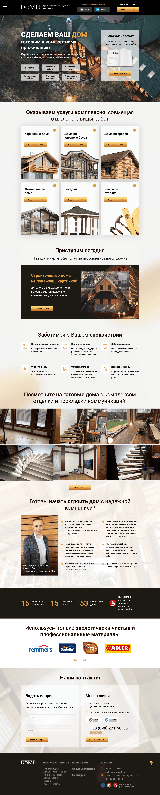

# Dom-D — лендинг компании по строительству деревянных домов

Адаптивный лендинг строительной компании «Dom-D»: каркасные дома, дома из клеёного бруса и брёвен, фахверковые дома, беседки и ремонт. Мой четвёртый учебный проект и самый масштабный на данный момент — 10 секций, 4 брейкпоинта и полноценная модульная SCSS-архитектура.

**[Открыть демо](https://ggadjiev.github.io/Dom-D/)**

Проект свёрстан по дизайн-макету без JavaScript: слайдеры и бургер-меню сейчас представляют собой статичные заготовки в разметке, стили готовы к подключению логики.



## Технологии

| Технология | Как используется |
| --- | --- |
| **HTML5** | Семантическая разметка: `header`, `main`, `section`, `article`, `footer`, формы с валидацией (`required`, `type="tel"`), инлайн-SVG-иконки |
| **БЭМ** | Нейминг `блок__элемент_модификатор` в разметке и стилях |
| **SCSS** | 18 партиалов в `styles/blocks/` — по одному файлу на блок, вложенность, `@use`-миксины |
| **CSS3** | Grid (34 раскладки), Flexbox, кастомные свойства в `:root`, `clamp()`, `calc()`, `backdrop-filter`, градиенты, `::before`/`::after`, `:hover`-состояния |
| **Шрифты** | Roboto, 4 начертания (400/500/700/900) в формате `woff2`, `font-display: swap` |
| **Нормализация** | `@a1rth/css-normalize` — современный сброс стилей через `:where()` с низкой специфичностью |

## Секции сайта

- **Шапка** — логотип, слоган «Строительство деревянных домов за 45 дней», кнопки мессенджеров (Viber, Telegram), телефон, кнопка «Перезвонить мне»
- **Главный экран** — оффер, перечень видов работ (демонтаж, бетонные и кровельные работы, возведение стен, отделка фасадов, инженерные работы), CTA «Заказать расчет»
- **Услуги** — 6 карточек с иллюстрациями: каркасные дома, дома из клеёного бруса, дома из брёвен, фахверковые дома, беседки, ремонт и отделка
- **Видео-блок** — приглашение к просмотру презентаций с заглушкой видео
- **Преимущества** — 6 пунктов с инлайн-SVG-иконками: фиксированная стоимость, поэтапная оплата, сроки, экологичность, самостоятельный закуп материалов, уборка после работ
- **Галерея работ** — 6 фотографий готовых домов с кнопками слайдера
- **О компании** — обращение руководителя Ярослава Доли и 6 тезисов о подходе к работе
- **Материалы и партнёры** — блок об экологичных материалах и логотипы партнёров
- **Контакты** — форма обратной связи (вопрос + телефон) и контактные данные
- **Подвал** — якорная навигация по видам строительства, соцсети, кнопка «наверх»

## Адаптивность

Вёрстка рассчитана на четыре разрешения через SCSS-миксины брейкпоинтов:

| Устройство | Ширина | Базовая ширина макета |
| --- | --- | --- |
| Desktop | ≥ 1921px | 1920px |
| Laptop | ≤ 1366px | 1366px |
| Tablet | 768–1366px | 768px |
| Mobile | ≤ 767px | 375px |

Помимо дискретных брейкпоинтов используются флюид-миксины `fluid-font(min, max, from, to)` и `fluid-width(...)` — они компилируются в медиазапросы с `calc()`-интерполяцией, поэтому размеры плавно масштабируются между контрольными точками без ручных пересчётов. Учтён `prefers-reduced-motion`, включён `scroll-behavior: smooth`.

## Структура проекта

```
├── .github/
│   └── workflows/
│       └── static.yml        # CI: публикация папки src/ на GitHub Pages
├── src/
│   ├── index.html            # разметка, 10 секций
│   ├── css/
│   │   └── styles.css        # скомпилированные стили (2315 строк)
│   ├── styles/
│   │   └── blocks/           # 18 SCSS-партиалов по БЭМ-блокам
│   ├── fonts/                # Roboto: 400 / 500 / 700 / 900 (woff2)
│   └── img/                  # SVG-иконки и PNG-иллюстрации
├── package.json
└── .gitignore
```

## Локальный запуск

Проект статический — достаточно отдать папку `src/` любым статическим сервером:

```bash
npx serve src
# или открыть src/index.html через Live Server в VS Code
```

Пути к ресурсам относительные, поэтому сервер должен отдавать `src/` как корень сайта (как это делает GitHub Pages).

## Деплой

При пуше в ветку `master` workflow `.github/workflows/static.yml` автоматически публикует содержимое `src/` на GitHub Pages: https://ggadjiev.github.io/Dom-D/. Сборка SCSS не требуется — в репозитории уже лежит актуальный скомпилированный `css/styles.css`.

## Особенность репозитория: утерянные SCSS-исходники

В процессе работы были случайно утеряны главный файл `styles.scss` и служебные партиалы (`_variables.scss`, `_mixins.scss`, `_media.scss`, `_utils.scss`, `_globals.scss`, `_fonts.scss`, `_normalize.scss`). Сохранились скомпилированный `css/styles.css` и все партиалы блоков из `styles/blocks/` — сайт полностью рабочий, однако пересобрать стили из исходников сейчас нельзя.